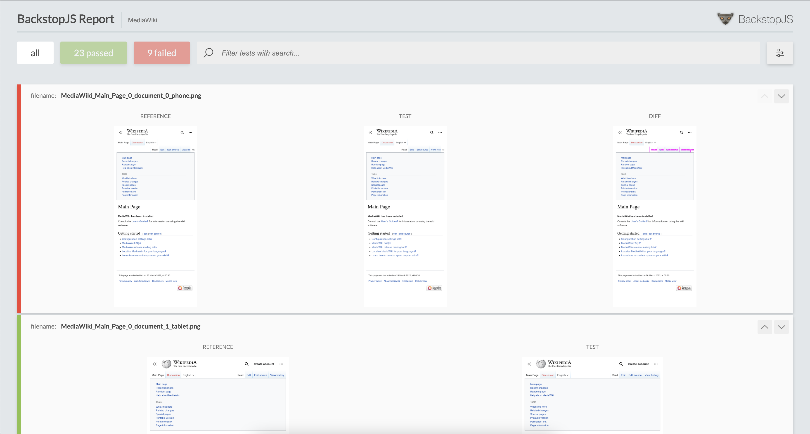

[](https://github.com/wikimedia/pixel/actions/workflows/push.yml)

# Pixel



🚨 **Pixel is currently an experimental proof of concept working towards becoming a more stable and useful solution. Only use it when you're feeling dangerous.** 🚨

Pixel is a visual regression tool for MediaWiki developers/QA engineers that
helps you replace manual testing with automated tests that catch web ui
regressions before users see them. It *currently* integrates
[BackstopJS](https://github.com/garris/BackstopJS),
[MediaWiki-Docker](https://www.mediawiki.org/wiki/MediaWiki-Docker), and Docker
under the hood.

Check out the hourly reports Pixel has generated at https://pixel.wmcloud.org
which compare the latest release branch against master, and read
[T302246](https://phabricator.wikimedia.org/T302246) for the motivation behind
the tool.

## Quick Start

First, clone the repo wherever you wish and `cd` into it:

```sh
git clone https://github.com/wikimedia/pixel.git && cd pixel
```

Pixel runs in multiple Docker containers to eliminate inconsistent rendering
issues across environments. Please install
[Docker](https://docs.docker.com/get-docker/) and 
**make sure it is running** prior to using Pixel.

Make sure you are running a compatible version of Node.js. The required version of Node is noted
in the [package.json](package.json#L14) file. We recommend using [NVM](https://github.com/nvm-sh/nvm#install--update-script) for managing different versions
of Node.js.

Finally, install the CLI dependency:

```sh
npm install
```

Running Pixel for the first time can take a long time (e.g. 5 minutes) as it
downloads Docker images, clones MediaWiki core (> 2GB) and a number of
extensions/skins. It will be much faster on subsequent runs as this data has
already been downloaded.

## Usage

Your workflow will usually involve the following ordered steps:

### 1) Take reference (baseline) screenshots with `master` or release branch code

If you want to checkout the latest code in `master` or `main` from MediaWiki
core and all of its installed extensions and skins and then take reference
screenshots that your test screenshots (step 2) will be compared against, then:

```sh
./pixel.js reference

```

Or if you want the reference to be the latest release branch:

```sh
./pixel.js reference -b latest-release
```

Or if you want the reference to be a certain release branch:

```sh
./pixel.js reference -b origin/wmf/1.39.0-wmf.18
```

If you want to run the mobile visual regression test suite pass the `--group
mobile` flag.

### 2) Take test screenshots with changed code

If you want to pull a change or multiple changes down from gerrit, take
screenshots with these changes on top of master and then compare these
screenshots against the reference screenshots, then

```sh
./pixel.js test -c Iff231a976c473217b0fa4da1aa9a8d1c2a1a19f2
```

Note that although change id `Iff231a976c473217b0fa4da1aa9a8d1c2a1a19f2` has a
`Depends-On` dependency, it is the only change that needs to be passed. Pixel
will figure out and pull down the rest of the dependencies provided that it has
the relevant repositories (set in repositories.json).

An HTML report of your test results with screenshots will be opened
automatically on a Mac after the test completes. If you're not on a Mac, you can
manually open the file at `report/index.html`.

Additionally, Pixel runs a server at `http://localhost:3000` (default) which can
be used to interact with/debug the same server that the tests use.

If you want to run the mobile visual regression test suite pass the `--group
mobile` flag.

### Stopping the services

If you want to stop all of Pixel's services, run:

```sh
./pixel.js stop
```

### Updates

Updating Pixel to the latest version can be done with the following command when
you are on the `main` branch:

```sh
./pixel.js update
```

This command will `git pull` the latest code from the `main` branch and destroy
all Docker containers, volumes, and networks associated with Pixel. It will also
rebuild any Docker images that need to be rebuilt to ensure that it is using the
latest database seed data and code.

### Cleanup

Sometimes after making MediaWiki code changes, database changes, or having
issues with the containers you just want to throw away everything and start
Pixel with a clean slate. To do that, run:

```sh
./pixels.js clean
```

You can also reset Pixel's database to its original state with:

```sh
./pixel.js reset-db
```

## Development

### Changing or adding tests

All tests are located in config files in the root directory (e.g.
configDesktop.js, configMobile.js, configEcho.js, etc).

For example, to test a new url in the `mobile` group:

1) Add a new object to the `tests` array in [configMobile.js](configMobile.js) with
the name of your test and its url path:

```js
{
	label: "<descriptive-name-of-your-test>",
	path: "<url-path-of-page>"
}
```

2) Run the tests with:

```sh
./pixel.js reference -g mobile -b latest-release
./pixel.js test -g mobile -b latest-release
```

This should always pass if the tests are deterministic as it is testing the same
code in MediaWiki (no changes).

For more info on how to change or add test config, please refer to the
[BackstopJS](https://github.com/garris/BackstopJS) README.

#### Groups

There are several groups of tests that can be run:

##### echo

UI checks on the mobile and desktop site limited to the Echo (notifications feature).

##### desktop

UI checks on the desktop site.

##### desktop-dev

UI checks on the desktop site with various feature flags enabled. Feature flags must be manually
updated inside [configDesktopDev.js](configDesktopDev.js).

##### mobile

UI checks on the mobile site.


### Configuring MediaWiki

All mediawiki config is in [LocalSettings.php](LocalSettings.php) and can be
changed. For example, perhaps you are working on a new feature in the `Vector`
skin that is feature flagged and want to enable it.

1) Edit [LocalSettings.php](LocalSettings.php)
2) Check that your config is usable at `localhost:3000`
3) Commit these changes and open a pull request in this repo with these changes

### Updating the database

Pixel gets its seed data from MariaDB backups hosted at
https://github.com/wikimedia/pixel-seed-data.

Please follow the [README.md](https://github.com/wikimedia/pixel-seed-data) in
that repo for step-by-step instructions on how to make database changes.

### Adding new extensions or skins

Pixel ships with a number of MediaWiki extensions and skins already installed.
Please reference the [repositories.json](repositories.json) file to see a
list of these.

To add a skin or extension that isn't currently supported:

1) Add it to the [repositories.json](repositories.json) file
2) Make Pixel rebuild its code volume by running `./pixel.js clean`. This will
destroy every container, image, volume, network associated with Pixel so they
can be rebuilt. 
3) Configure the extension or skin in [LocalSettings.php](LocalSettings.php).
4) Run `./pixel.js reference` to rebuild everything. This will also run the
`maintenance/update.php` script which executes any needed database schema
changes. This will take awhile as Mediawiki core, extensions, and skins get
downloaded again.
4) Check that your extension or skin is usable at `localhost:3000`
5) If there were any database changes involved, you'll need to update the seed
data that is shared amongst users of Pixel. To do this, please follow steps 3
through 9 on the [Pixel seed data](https://github.com/wikimedia/pixel-seed-data)
repo.
6) Commit these changes and open a pull request in this repo with these changes

## Issues

Please file all bugs, requests, and issues on the [web team's visual regression phabricator board](https://phabricator.wikimedia.org/project/board/5933/)


## Roadmap

Future plans can be seen by visiting the [web team's visual regression
phabricator board](https://phabricator.wikimedia.org/project/board/5933/) under
the "Roadmap (Epics)" column.
